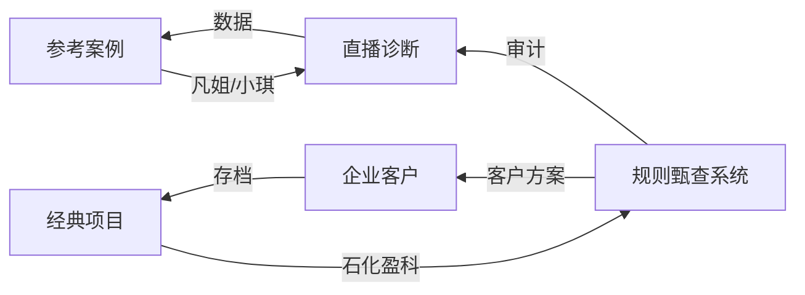

# 工作资料库

> E盘工作文件分类知识库。不复制文件，只做索引导航。
>
> 原始文件在 `E:\...` 中，本库记录它们在哪、做什么、怎么关联。

## 目录结构

```
E盘工作分区
├── 核心项目     → [[工作资料库/MyCodeProjects]]  ← 规则甄查 + 直播诊断
├── 客户项目     → [[工作资料库/客户项目/Index]]        ← 30+ 企业
├── 经典存档     → [[工作资料库/经典项目]]        ← RFID / 私有云
├── 文档资料     → [[工作资料库/文档资料]]        ← 教育 / 华德福
└── 开发环境     → [[工作资料库/开发环境]]        ← 工具链 / IDE
```

## 核心概念：你在做什么



| 项目 | 干啥的 | 技术栈 |
|------|--------|--------|
| [[工作资料库/规则甄查系统]] | AI 内容审计、品牌合规检测 | Python, MCP, JSON-RPC |
| [[工作资料库/直播监控系统]] | 双平台直播监控、STT/OCR/Triage | Python, Vosk, OpenCV |
| [[工作资料库/宝妈直播诊断]] | 苏苏在浙里 / 清晨烟火小厨 | 视频诊断引擎 |
| [[工作资料库/参考案例]] | 凡姐 / 农村小琪 / 凡姐走乡村 | 案例分析 |

## 客户全景

| 行业 | 笔记 | 代表客户 |
|------|------|----------|
| 轨道交通 | [[工作资料库/客户项目/轨交]] | 易程创新、广东暨通、南京浦镇 |
| 能源电力 | [[工作资料库/客户项目/能源]] | 石化盈科、中达电通、伊顿电源 |
| IT 通信 | [[工作资料库/客户项目/IT通信]] | 上海博达、深信服、锐捷网络 |
| 综合/其他 | [[工作资料库/客户项目/综合]] | 芯陆、京源、航天科工 |

`路径`: [[工作资料库/客户项目/Index]] — 全量客户明细

## 快速查找

> 找客户 → [[工作资料库/客户项目/Index]]
> 找代码 → [[工作资料库/MyCodeProjects]]
> 找旧项目 → [[工作资料库/经典项目]]
> 找文档 → [[工作资料库/文档资料]]
> 找工具 → [[工作资料库/开发环境]]

---

*Created 2026-05-11 · 按 Karpathy 知识库风格组织*
