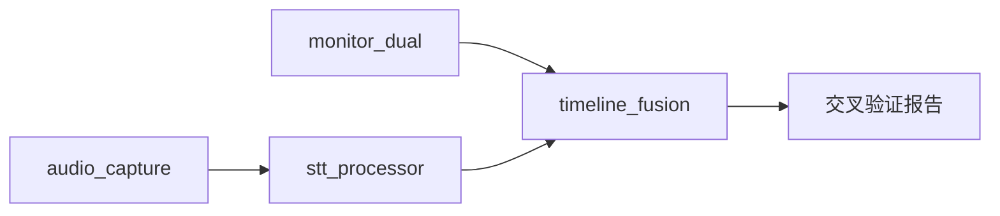

# 直播监控系统

> 双平台 (视频号+抖音) 直播监控。音频捕获 → STT → OCR → 视觉 Triage → 融合时间线。
>
> **路径**: `E:\MyCodeProjects\02-审计工具\`
> **技术栈**: Python, WASAPI, Vosk, OpenCV

## 组件

| 模块 | 文件 | 职责 |
|------|------|------|
| WASAPI 捕获 | `audio_capture.py` | 系统音频录制 (48kHz/2ch) |
| 语音转文字 | `stt_processor.py` | Vosk 离线 STT |
| 双平台监控 | `monitor_dual.py` | 评论区 OCR (30s) + 视觉 Triage (5min) |
| 时间线融合 | `timeline_fusion.py` | OCR+STT+Triage 数据融合 |
| 核心审计 | `audit_core.py` | 审计评分逻辑 |

## 全流程



1. `audio_capture.py` → WASAPI 系统音频
2. `stt_processor.py` → Vosk 离线转文字
3. `monitor_dual.py --auto` → 评论区 OCR + 视觉 Triage
   - 人脸检测 (Haar Cascade)
   - 区域亮度矩阵 (左/中/右)
   - 食物饱和度追踪
4. `timeline_fusion.py` → 融合所有数据流
5. 下播 → 视频 177 帧采样 → 交叉验证报告

## 一键操作

```bash
# 全部启动
python audio_capture.py & python stt_processor.py & python monitor_dual.py --auto & python timeline_fusion.py

# 校准评论区坐标 (首次)
python monitor_dual.py --calibrate

# 用户指令
"开始直播监控"  → 全部启动
"直播结束，出报告" → 停止+分析+复盘报告
```

## 关联

- [[工作资料库/规则甄查系统]] — 审计引擎驱动评分
- [[工作资料库/宝妈直播诊断]] — 目标主播诊断
- [[工作资料库/参考案例]] — 对比分析素材
